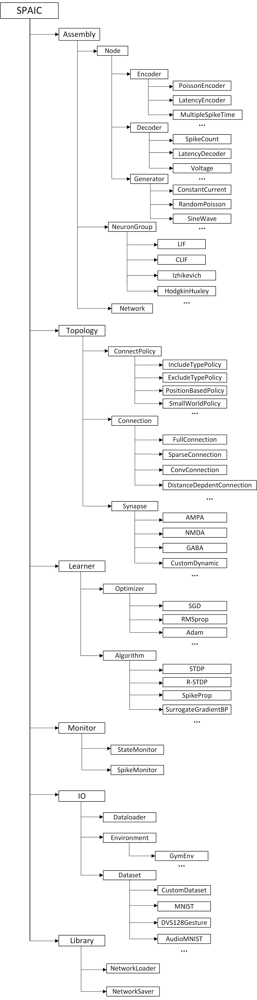

===================
基础结构
===================

基本组成
===================

**SPAIC** 中最重要的基类是 ``Assembly`` ，一个个的 ``Assembly`` 节点以及节点间的连接 ``Connection`` 最终组成了一个网络。\
在 ``Assembly`` 中，包含了 ``Network`` 、 ``NeuronGroup`` 以及 ``Node`` 这三个部分， ``Network`` 类即为整个网络， \
``NeuronGroup`` 类则包含了各层的神经元， ``Node`` 为输入输出的节点。

平台前端结构图：

Assembly (神经集合)
--------------------------
:code:`Assembly` 是神经网络结构中最为上层的抽象类，代表任意网络结构，其它网络模块都是 ``Assembly`` 类的子类。 ``Assembly`` 对象具有 :code:`_groups` ,\
:code:`_connections` 的两个dict属性，用于保存神经集合内部的神经集群以及连接等。作为网络建模的主要接口，包含如下主要建模函数：

    - **add_assembly(name, assembly)** -- 向神经集合中加入新的集合成员
    - **del_assembly(assembly, name)** -- 删除神经集合中已经存在的某集合成员
    - **copy_assembly(name, assembly)** -- 复制一个已有的assembly结构，并将新建的assembly加入到此神经集合
    - **replace_assembly(old_assembly, new_assembly)** -- 将集合内部已有的一个神经集合替换为一个新的神经集合
    - **merge_assembly(assembly)** -- 将此神经集合与另一个神经集合进行合并，得到一个新的神经集合
    - **select_assembly(assemblies, name)** -- 将此神经集合中的部分集合成员以及它们间的连接取出来组成一个新的神经集合，原神经集合保持不变
    - **add_connection(name, connection)** -- 连接神经集合内部两个神经集群
    - **del_connection(connection, name)** -- 删除神经集合内部的某个连接
    - **assembly_hide()** -- 将此神经集合隐藏，不参与此次训练、仿真或展示。
    - **assembly_show()** -- 将此神经集合从隐藏状态转换为正常状态。

NeuronGroup (神经元集群)
--------------------------
:code:`spaic.NeuronGroup` 是包含了一定数量的神经元的类，通常我们称其为一层具有相同神经元模型以及连接方式的神经元组。 更多细节参考 :doc:`./1_neuron`

Node (节点)
--------------------------
:code:`spaic.Node` 是神经网络输入输出的转换节点，包含编解码机制，将输入转化为放电或将放电转化为输出。 :code:`Encoder` , :code:`Decoder` , \
:code:`Generator` , :code:`Action` 以及 :code:`Reward` 都继承自 :code:`Node`. 更多细节参考 :doc:`./5_encode_decode`

Network (网络)
--------------------------
:code:`spaic.Network` 在 **SPAIC** 中处于模型的最顶层，许多其他的模块，例如 :code:`NeuronGroup` 以及 \
:code:`Connection` 都需要被包含于 ``Network`` 中。 ``spaic.Network`` 也负责训练、模拟以及一些数据交互的过程。 \
:code:`spaic.Network` 支持的一些常用的交互函数如下:

    - **run(rum_time)** -- 运行网络，run_time为网络仿真时间窗
    - **save_state** -- 保存网络权重
    - **state_from_dict** -- 读取网络权重

Projection (拓扑连接)
-------------------------
:code:`spaic.Projection` 是拓扑结构中的一个高级抽象类，与 ``Connection`` 不同的是， ``Projection`` 代表了 ``Assembly`` 之间的连接。 \
当用户在 ``Assembly`` 之间构建 ``Projection`` 时， 网络的构建函数将会根据 ``Projection`` 的 ``policies`` 属性生成相对应的连接。

Connection (连接)
--------------------------
:code:`spaic.Connection` 用于在神经元组之间构建连接，也用于构建不同类型的突触。更多具体介绍参考 :doc:`./2_connection` 。

Backend (后端)
--------------------------
后端核心，负责实际构建变量以及生成计算图。更多具体的介绍参考 :doc:`../backend` 。

具体细节
======================
.. toctree::
   :maxdepth: 1
   :titlesonly:

   1_neuron
   2_connection
   3_synaptic
   4_algorithm
   5_encode_decode
   6_network