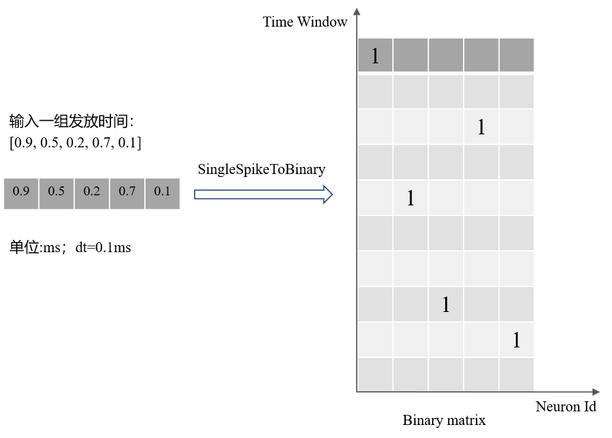

编码解码
====================
本章节主要关注 **SPAIC** 平台中的编码、解码、信号生成、奖励以及动作生成。\
该章节主要分为五大块，编码器、生成器、解码器、奖励器以及动作器。

编码器(Encoder)
-------------------------------
:code:`Encoder` 类是 :code:`Node` 类的子类，编码器主要用于在脉冲神经网络中，将输入的数据转化为脉冲神经网络可用的时序脉冲数据。因为\
对于脉冲神经网络而言，以往人工神经网络中的数值输入不符合生理特征，通常使用二值的脉冲数\
据数据输入。并且静态的数据输入无法获取数据的时间特征，转化为具有时序的脉冲数据能够更好\
地表现数据的时序特征。在 **SPAIC** 中，我们内置了一系列较为常见的编码方式：

- SingleSpikeToBinary ('sstb')
- MultipleSpikeToBinary ('mstb')
- PoissonEncoding ('poisson')
- Latency ('latency')
- NullEncoder ('null')

实例化编码类时，用户需要指定 **shape** 或 **num** , **coding_method** 以及其他相关参数.

SingleSpikeToBinary ('sstb')
^^^^^^^^^^^^^^^^^^^^^^^^^^^^^^^^^^^^^^^^^^
如果输入数据是记录了神经元发放时间的向量，并且一个神经元对应一个神经发放，我们可以使用 :code:`SingleSpikeToBinary` 将发放时间转换为二进制矩阵，\
如图所示，其中发放时间转化为时间窗口的索引。

例如，将该输入样本的发放时间[0.9,0.5,0.2,0.7,0.1]转换为二进制矩阵。

.. code-block:: python

    self.input = spaic.Encoder(num=node_num, coding_method='sstb')
    # or
    self.input = spaic.Encoder(shape=[node_num], coding_method='sstb')

.. note::
    Node的 **num** 等于给定输入样本的大小，即5，网络运行时间等于给定输入样本的最大发放时间加上dt，即1.0。

MultipleSpikeToBinary ('mstb')
^^^^^^^^^^^^^^^^^^^^^^^^^^^^^^^^^^^^^^^^^^
如果输入数据包含发放神经元的索引及其发放时间，我们可以使用 :code:`MultipleSpikeToBinary` 将发放索引和发放时间转换为二进制矩阵。\
例如，将[[0.9,0.5,0.2,0.7,0.1]、[1,1,3,2,6]]转换为二进制矩阵。

.. code-block:: python

    self.input = spaic.Encoder(num=node_num, shape=[2, node_num], coding_method='mstb')

.. note::
    - 由于一个神经元对应于零或多个脉冲时间，每个样本的大小可能不同。
    - Node的 **num** 等于给定输入样本的神经元索引的最大id加1，即7。
    - 一个样本的 **shape** 应该是[2, node_num]，其中第一行是发放时间向量，第二行是神经元ID向量。
    - 对于 :code:`MultipleSpikeToBinary` 编码方法，需要同时指定初始化参数 **num** 和 **shape** 。

PoissonEncoding ('poisson')
^^^^^^^^^^^^^^^^^^^^^^^^^^^^^^^^^^^^^^^^^^
泊松编码方法编码方法属于速率编码。刺激越强，放电频率越高。以图像输入为例，首先将像素强度映射到输入神经元的瞬时放电速率。\
然后在每个时间步，生成0到1之间的均匀随机数，并与瞬时放电率进行比较。如果随机数小于瞬时放电率，则生成脉冲。

下面的代码定义了一个 :code:`PoissonEncoding` 对象，它将输入转换为泊松脉冲序列。

.. code-block:: python

    self.input = spaic.Encoder(num=node_num, coding_method='poisson')

.. note::
    - 对于全连接，可以不指定初始化参数 **shape** 。
    - 对于卷积连接，初始化参数 **shape** 应指定为[channel, width, height]，在这种情况下，可以不指定初始化参数 **num** 。
    - 对于泊松编码，有时我们需要缩放输入强度，这可以通过指定 **unit_conversion** 参数来实现：

        **unit_conversion** - 一个缩放输入速率的常量参数，默认为1.0.

Latency ('latency')
^^^^^^^^^^^^^^^^^^^^^^^^^^^^^^^^^^^^^^^^^^
外部刺激越强，神经元放电越早。以图像输入为例，图像中的灰度值越大，信息越重要，对应的神经元的放电时间越早。

下面的代码定义了一个 :code:`Latency` 对象，它将输入转换为脉冲序列。

.. code-block:: python

    self.input = spaic.Encoder(num=node_num, coding_method='latency')

.. note::
    - 对于全连接，可以不指定初始化参数 **shape** 。
    - 对于卷积连接，初始化参数 **shape** 应指定为[channel, width, height]，在这种情况下，可以不指定初始化参数 **num** 。

NullEncoder ('null')
^^^^^^^^^^^^^^^^^^^^^^^^^^^^^^^^^^^^^^^^^^
如果不需要编码方法，我们可以使用 ``NullEncoder`` 。\
以下代码定义了 :code:`NullEncoder` 对象。

.. code-block:: python

    self.input = spaic.Encoder(num=node_num, coding_method='null')

.. note::
    - 对于全连接，可以不指定初始化参数 **shape** 。
    - 对于卷积连接，初始化参数 **shape** 应指定为[channel, width, height]，在这种情况下，可以不指定初始化参数 **num** 。
    - 对于全连接，外部输入的形状应为[batch_size, time_step, node_num]。
    - 对于卷积连接，外部输入的形状应为[batch_size, time_step, channel, width, height]。

生成器(Generator)
------------------------------
:code:`Generator` 类是 :code:`Node` 类的子类。它是一种特殊的编码器，可以在没有数据集的情况下生成脉冲序列或输入电流。\
生成器主要的作用在于，有时在进行神经元动力学仿真时，我们需要特殊的输入模式，因此我们需要\
有一些特殊的脉冲或者是电流模式的生成器。在 **SPAIC** 中，我们内置了一些模式生成器：

- **poisson_generator** - 根据输入速率生成泊松脉冲序列
- **cc_generator** - 生成恒定电流输入

实例化编码类时，用户需要指定 **shape** 或 **num** 、 **coding_method** 和其他相关参数。

Poisson_Generator ('poisson_generator')
^^^^^^^^^^^^^^^^^^^^^^^^^^^^^^^^^^^^^^^^^^
泊松生成器方法根据输入速率生成脉冲序列。在每个时间步，生成0到1之间的均匀随机数，并与输入速率进行比较。如果随机数小于输入速率，则生成脉冲。

下面的代码定义了一个 :code:`Poisson_Generator` 对象，该对象将输入速率转换为泊松脉冲序列。

.. code-block:: python

    self.input = spaic.Generator(num=node_num, coding_method='poisson_generator')

.. note::
    - 对于全连接，可以不指定初始化参数 **shape** 。
    - 对于卷积连接，初始化参数 **shape** 应指定为[channel, width, height]，在这种情况下，可以不指定初始化参数 **num** 。
    - 如果外部输入为常数值，则默认情况下，所有节点的输入速率相同。
    - 如果每个节点需要不同的输入速率，则应传入对应于节点形状的输入矩阵。
    - 有时我们需要调整输入速率，这可以通过指定 **unit_conversion** 参数来实现:

        **unit_conversion** - 一个缩放输入速率的常量参数，默认为1.0。

CC_Generator ('cc_generator')
^^^^^^^^^^^^^^^^^^^^^^^^^^^^^^^^^^^^^^^^^^
:code:`CC_Generator` 可以产生恒定电流输入，这有助于用户观察和模拟各种神经元动力学。

下面的代码定义了一个 ``CC_Generator`` 对象，它将输入速率转换为脉冲序列。

.. code-block:: python

    self.input = spaic.Generator(num=node_num, coding_method='cc_generator')

.. note::

    :code:`CC_Generator` 的注意事项和 :code:`Poisson_Generator` 的类似

解码器
------------------------------
:code:`Decoder` 类是 :code:`Node` 类的子类，其主用于在脉冲神经网络中，将输出的脉冲信号或电压转换为数字信号，例如根据 :code:`spike_counts` \
的规则选取发放脉冲数量最多的神经元作为预测结果，亦或是根据 :code:`first_spike` \
的规则选取第一个发放脉冲的神经元作为预测结果。

在 **SPAIC** 中，我们也内置了大多数较为常见的解码方式：

- **Spike_Counts ('spike_counts')** -- 获得目标层中每个神经元的平均脉冲计数。
- **First_Spike ('first_spike')** -- 获取目标层中每个神经元的第一次发放时间。
- **Final_Step_Voltage ('final_step_voltage')** -- 获得目标层中每个神经元最后一步的电压。
- **Voltage_Sum ('voltage_sum')** -- 获得目标层中每个神经元在时间窗口内的电压和。

解码器主要在脉冲输出阶段使用，在实例化解码类时，用户需要指定 **num** 、 **dec_target** 、 **coding_method** 和相关参数\

例如，当解码具有10个LIF神经元的 :code:`NeuronGroup` 对象的脉冲活动时，我们可以创建 :code:`Spike_Counts` 类的实例：

.. code-block:: python

    self.target = spaic.NeuronGroup(num=10, model='lif')
    self.output = spaic.Decoder(num=10, dec_target=self.target, coding_method='spike_counts')

.. note::
    - 参数 **dec_target** 的值是要解码的层对象
    - :code:`Decoder` 类中参数 **num** 的值应与目标层中 **num** 的值相同
    - 若要实例化其他解码类，只需将相应类的str名称赋值给 **coding_method** 参数即可
    - 参数 **coding_var_name** 的值是要解码的变量，例如'O'或'V'，'O'表示脉冲，'V'表示电压。
    - 对于 :code:`Spike_Counts` 和 :code:`First_Spike` ，参数 **coding_var_name** 的默认值为'O'。
    - 对于 :code:`Final_Step_Voltage` 和 :code:`Voltage_Sum` ，参数 **coding_var_name** 的默认值为'V'。

奖励器
------------------------------
:code:`Reward` 类是 :code:`Node` 类的子类，它可以被看作是一种不同类型的解码器。主要作用是在执行强化任务的时候，有时需要根据任务目的解码指定对象的活动并\
设定奖励规则来获取奖励。例如分类任务下的 :code:`global_reward` 的规则，根据脉冲发放数量\
或者最大膜电位确定预测结果，若预测结果是期望的结果，则返回正奖励；\
若不等，则返回负奖励。样本的 ``batch_size>1`` 时，返回取均值后的奖励作为全局奖励。\
在 **SPAIC** 中，我们内置了一些奖励类：

- **Global_Reward ('global_reward')** -- 获得全局奖励。对于分类任务，根据脉冲数或最大膜电位确定预测标签。如果预测标签与实际标签相同，则将返回正奖励。相反，将返回负奖励。
- **XOR_Reward ('xor_reward')** -- XOR任务的奖励机制。当输入模式的期望结果为1时，如果输出脉冲数大于0，将获得正奖励。当期望结果为0时，如果输出脉冲数大于0，则获得惩罚。
- **DA_Reward ('da_reward')** -- 获得与 ``dec_target`` 中神经元相同维度的奖励。
- **Environment_Reward ('environment_reward')** -- 从强化学习环境中获得奖励。

奖励器主要在脉冲输出阶段使用，在实例化奖励类时，用户需要指定 **num** 、 **dec_target** 、 **coding_method** 和相关参数\
例如当解码含有10个LIF神经元的 ``NeuronGroup`` 对象的脉冲活动以获得全局奖励时，我们可以这样建立 ``Global_Reward`` 类实例:

.. code-block:: python

    self.target = spaic.NeuronGroup(num=10, model='lif')
    self.reward = spaic.Reward(num=10, dec_target=self.target, coding_method='global_reward')

.. note::
    - 参数 **dec_target** 的值是要解码的层对象
    - :code:`Reward` 类中参数 **num** 的值应与目标层中 **num** 的值相同
    - 若要实例化其他奖励类，只需将相应类的str名称赋值给 **coding_method** 参数即可
    - 参数 **coding_var_name** 的值是要解码的变量，例如'O'或'V'，'O'表示脉冲，'V'表示电压。
    - 参数 **coding_var_name** 的默认值为'O'。

对于 :code:`Global_Reward` 、 :code:`XOR_rewage` 和 :code:`DA_revage` ，我们可以指定一些参数：

- **pop_size** - 解码神经元的总体大小，默认为1（每个类别由一个神经元表示）
- **dec_sample_step** - 解码采样时间步长，默认为1（每个时间步长获得奖励）
- **reward_signal** - 奖励，默认为1.0
- **punish_signal** - 惩罚，默认为-1.0

动作器
------------------------------
``Action`` 类是 :code:`Node` 类的子类，它也是一个特殊的解码器，将输出转换为动作。主要作用是在执行GYM强化环境中的强化任务时，需要根据指定对象的活动设定动作选择机制\
选择接下来要执行的动作。例如 ``PopulationRate_Action`` 规则，解码对象的神经元的群体数与动作数目个数一致，\
以每个群体的发放速率为权重来选择下一步动作，群体的发放速率越大，选中的可能性越大。\
在 **SPAIC** 中，我们内置了一些动作类：

- **Softmax_Action ('softmax_action')** -- 基于目标层的脉冲，使用softmax函数选择动作。
- **PopulationRate_Action ('pop_rate_action')** -- 将具有最大脉冲频率的神经元群体的标签作为动作。
- **Highest_Spikes_Action ('highest_spikes_action')** -- 将目标层中发放脉冲最多的神经元的标签作为动作。
- **Highest_Voltage_Action ('highest_voltage_action')** -- 将目标层中具有最大电压的神经元的标签作为动作。
- **First_Spike_Action ('first_spike_action')** -- 将目标层中第一个发放脉冲的神经元的标签作为动作。
- **Random_Action ('random_action')** -- 从动作空间随机采样获得动作。

动作器主要在脉冲输出阶段使用，在实例化动作类时，用户需要指定 **num** 、 **dec_target** 、 **coding_method** 和相关参数\
例如当解码含有10个LIF神经元的 ``NeuronGroup`` 对象的脉冲活动以获得下一步活动时，我们可以这样建立 :code:`Softmax_Action` 类实例:

.. code-block:: python

    self.target = spaic.NeuronGroup(num=10, model='lif')
    self.reward = spaic.Action(num=10, dec_target=self.target, coding_method='softmax_action')

.. note::
    - 参数 **dec_target** 的值是要解码的层对象
    - :code:`Action` 类中参数 **num** 的值应与目标层中 **num** 的值相同。
    - 若要实例化其他动作类，只需将相应类的str名称赋值给 **coding_method** 参数即可。
    - 参数 **coding_var_name** 的值是要解码的变量，例如'O'或'V'，'O'表示脉冲，'V'表示电压。

对于 :code:`PopulationRate_Action` ，我们可以指定 **pop_size** 参数:

    - **pop_size** - 解码神经元的总体大小，默认为1（每个类别由一个神经元表示）
