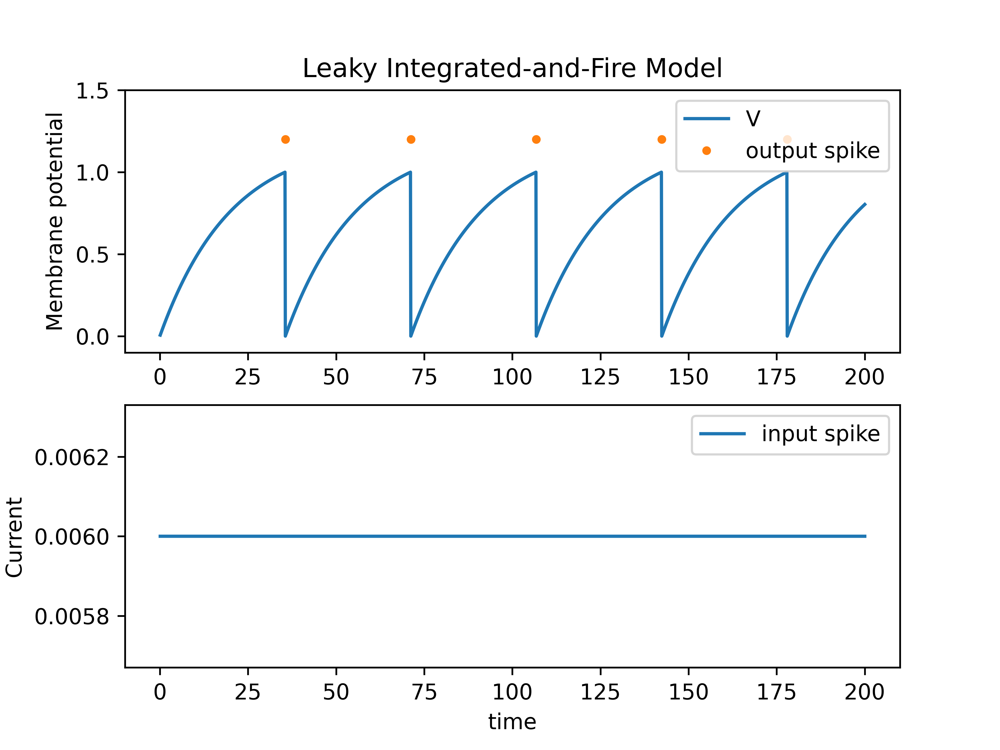
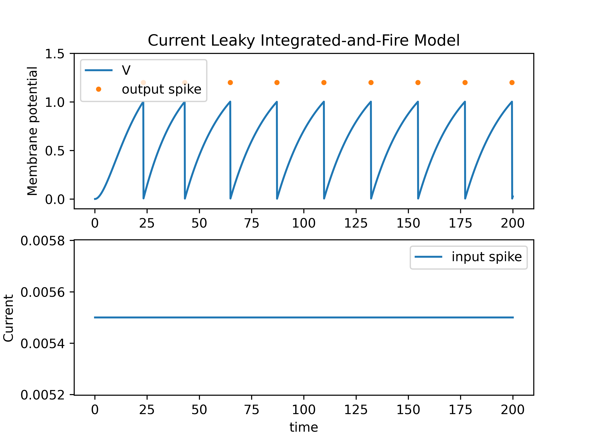
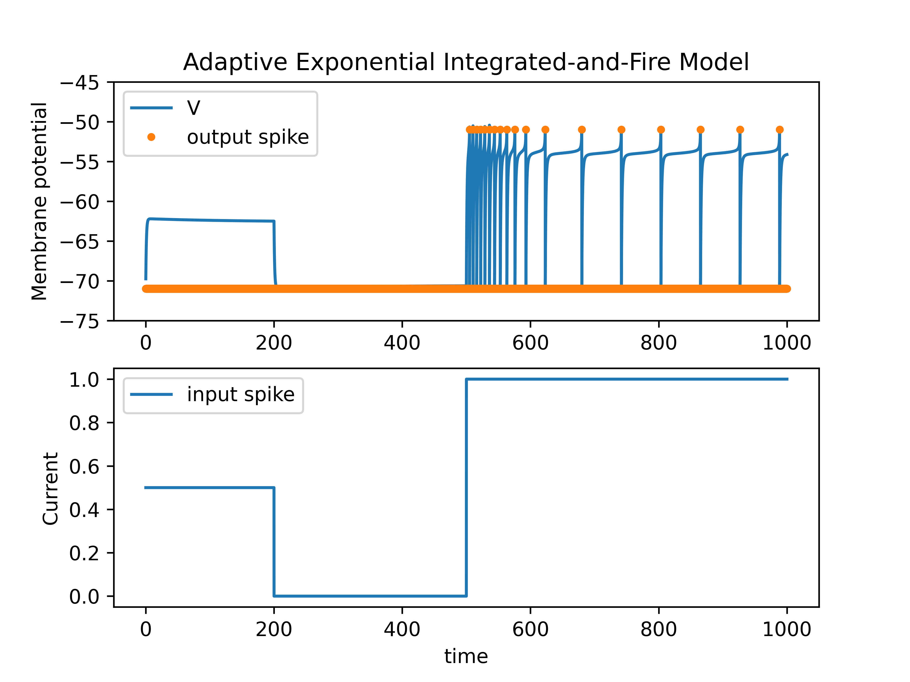
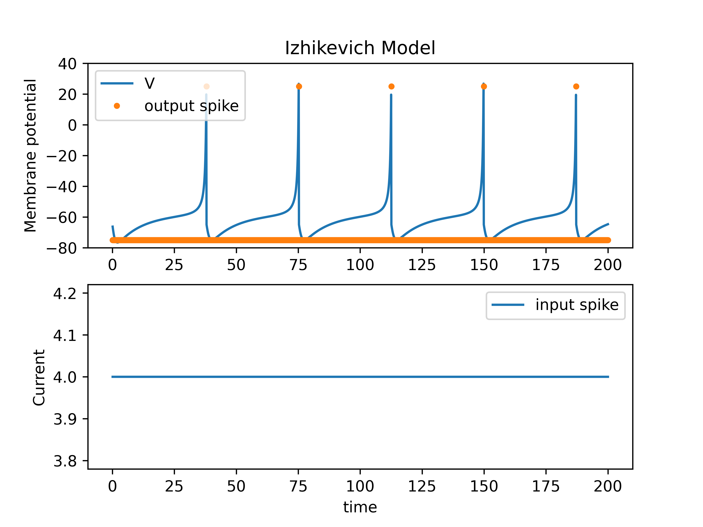
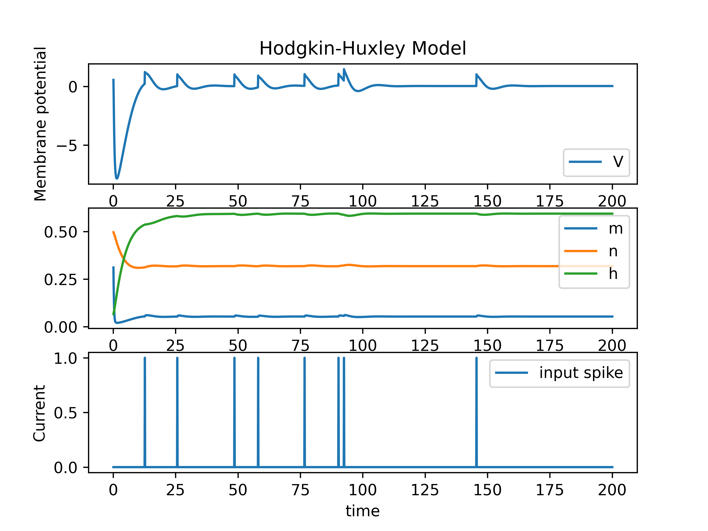

Neuron
=====================

This chapter introduces how to choose neuron model and change some important parameters of the model.

neuron model
----------------
Neuron model is one of the most important component of the model. Different neuron model will have different \
neuron dynamics. In spiking neuron network, people always convert the change of membrane potential of neuron model \
into different equation and approximate it by difference equation. Finally, obtain the differential neuron model \
that can be computed by computer. In **SPAIC** , we contains most of the common neuron models:

- **IF** - Integrate-and-Fire model
- **LIF** - Leaky Integrate-and-Fire model
- **CLIF** - Current Leaky Integrate-and-Fire model
- **GLIF** - Generalized Leaky Integrate-and-Fire model
- **aEIF** - Adaptive Exponential Integrate-and-Fire model
- **IZH** - Izhikevich model
- **HH** - Hodgkin-Huxley model

In **SPAIC** , :code:`NeuronGroup` is like nodes of the network model. Like layers in **PyTorch** , in **SPAIC** , \
``NeuronGroup`` is the layer. Users need to specify the neuron numbers, neuron model or other related paramters.

.. code-block:: python

    from spaic import NeuronGroup

LIF neuron model
-----------------------
**LIF(Leaky Integrated-and-Fire Model)** neuron formula and parameters:

.. math::
    V & = tua\_m * V + I \\
    O & = spike\_func(V^n)

For example, we build a layer with 100 **LIF** neurons:

.. code-block:: python

    self.layer1 = NeuronGroup(num=100, model='lif')

A layer with 100 standard **LIF** neurons has been constructed. While, sometimes we need to specify the **LIF** \
neuron to get different neuron dynamics, that we will need to specify some parameters:

- **tau_m** - time constant of neuron membrane potential, default as 6.0
- **v_th** - the threshold voltage of a neuron, default as 1.0
- **v_reset** - the reset voltage of the neuron, which defaults to 0.0

If users need to change these parameters, they can enter the parameters when construct ``NeuronGroups`` .

.. code-block:: python

    self.layer2 = NeuronGroup(num=100, model='lif',
                    tau_m=10.0, v_th=10, v_reset=0.2)

CLIF neuron model
-------------------------
**CLIF(Current Leaky Integrated-and-Fire Model)** neuron formula and parameters:

.. math::

    V(t) & = M(t) - S(t) - E(t) \\
    I & = V0 * I \\
    M & = tau\_p * M + I \\
    S & = tau\_q * S + I \\
    E & = tau\_p * E + Vth * O \\
    O & = spike\_func(V)

- **tau_p, tau_q** - time constants of synapse, default as 12.0 and 8.0
- **tau_m** - time constant of neuron membrane potential, default as 20.0
- **v_th** - the threshold voltage of a neuron, default as 1.0

GLIF neuron model
-------------------------
**GLIF(Generalized Leaky Integrate-and-Fire Model)** [#f1]_ neuron parameters:

- R, C, E_L
- Theta_inf
- f_v
- delta_v
- b_s
- delta_Theta_s
- k_1, k_2
- delta_I1, delta_I2
- a_v, b_v

aEIF neuron model
-------------------------
**aEIF(Adaptive Exponential Integrated-and-Fire Model)** [#f2]_ neuron model and parameters:

.. math::
    V & = V + dt / C * (gL * (EL - V + EXP) - w + I^n[t]) \\
    w & = w + dt / tau\_w * (a * (V - EL) - w) \\
    EXP & = delta\_t * exp(dv\_th/delta\_t) \\
    dv & = V - EL \\
    dv\_th & = V - Vth \\
    O & = spike\_func(V^n) \\
    if\quad V & > 20: \\
    then\quad V & = EL, w = w + b

- **C, gL** - membrane capacitance and leak conductance
- **tau_w** - adaptation time constant
- **a.** - subthreshold adaptation
- **b.** - spike-triggered adaptation
- **delta_t** - slope factor
- **EL** - leak reversal potential

IZH neuron model
--------------------------
**IZH(Izhikevich Model)** [#f3]_  neuron model and parameters:

.. math::
    V &= V + dt / tau\_M * (C1 * V * V + C2 * V + C3 - U + I)  \\
    V &= V + dt / tau\_M * (V* (C1 * V + C2) + C3 - U + I) \\
    U &= U + a. * (b. * V - U) \\
    O &= spike\_func(V^n) \\
    if\quad V &> Vth, \\
    then\quad V &= Vreset, U = U + d

- **tau_m**
- **C1, C2, C3**
- **a, b, d**
- **Vreset** - Voltage Reset

HH neuron model
--------------------------
**HH(Hodgkin-Huxley Model)**  [#f4]_ neuron model and parameters:

.. math::
    V & = V + dt/tau\_v * (I - Ik) \\
    Ik & = NA + K + L \\
    NA & = g\_NA * m^3 * h * (V - V_NA) \\
    K & = g\_K * n^4 * (V - V_K) \\
    L & = g\_L * (V - V_L) \\
    K\quad activation: \\
    n & = n + dt/tau\_n * (alpha\_n * (1-n) - beta\_n * n) \\
    Na\quad activation: \\
    m & = m + dt/tau\_m * (alpha\_m * (1-m) - beta\_m * m) \\
    Na\quad inactivation: \\
    h & = h + dt/tau\_h * (alpha\_h * (1-h) - beta\_h * h) \\
    alpha\_m & = 0.1 * (-V + 25) / (exp((-V+25)/10) - 1) \\
    beta\_m & = 4 * exp(-V/18) \\
    alpha\_n & = 0.01 * (-V + 10) / (exp((-V+10)/10) - 1) \\
    beta\_n & = 0.125 * exp(-V/80) \\
    alpha\_h & = 0.07 * exp(-V/20) \\
    beta\_h & = 1/(exp((-V+30)/10) + 1) \\
    O & = spike\_func(V)

- **dt**
- **g_NA, g_K, g_L**
- **E_NA, E_K, E_L**
- **alpha_m1, alpha_m2, alpha_m3**
- **beta_m1, beta_m2, beta_m3**
- **alpha_n1, alpha_n2, alpha_n3**
- **beta_n1, beta_n2, beta_n3**
- **alpha_h1, alpha_h2, alpha_h3**
- **beta_1, beta_h2, beta_h3**
- **Vreset**
- **m, n, h**
- **V, v_th**

customize
----------------
In the following chapter called  :ref:`my-custom-neuron-en` , we will talke about how to add custom neuron model \
into **SPAIC** with more details.

.. [#f1] **GLIF model** : Teeter, C., Iyer, R., Menon, V., Gouwens, N., Feng, D., Berg, J., ... & Mihalas, S. (2018). Generalized leaky integrate-and-fire models classify multiple neuron types. Nature communications, 9(1), 1-15.
.. [#f2] **AEIF model** : Brette, Romain & Gerstner, Wulfram. (2005). Adaptive Exponential Integrate-And-Fire Model As An Effective Description Of Neuronal Activity. Journal of neurophysiology. 94. 3637-42.` doi:10.1152/jn.00686.2005. <https://doi.org/10.1152/jn.00686.2005>`_
.. [#f3] **IZH model** : Izhikevich, E. M. (2003). Simple model of spiking neurons. IEEE Transactions on neural networks, 14(6), 1569-1572.
.. [#f4] **HH model** : Hodgkin, A. L., & Huxley, A. F. (1952). A quantitative description of membrane current and its application to conduction and excitation in nerve. The Journal of physiology, 117(4), 500.
