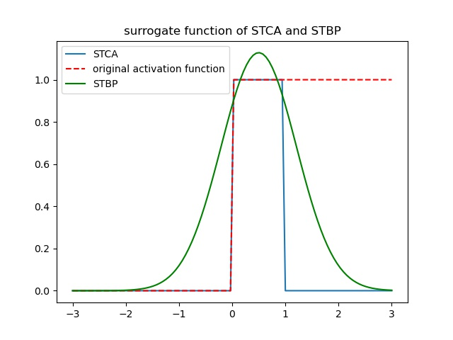

.. _my-customalgorithm:

算法自定义
===========================

替代梯度算法
---------------------------
在脉冲神经网络反向传播过程中，脉冲激活函数 :math:`output\_spike = sign(V>V_th)` 的导数为：

.. math::

    \begin{array}{c}
    \delta (v) = \left\{\begin{matrix}
    +\infty,   & v = v_{th} \\
    0, & v\ne  v_{th}
    \end{matrix}\right.
    \end{array}

显然，直接使用脉冲激活函数进行梯度下降会使得网络的训练及其不稳定，因此我们使用梯度替代算法近似脉冲激活函数。替代梯度算法最重要的过程即为使用用户自己的梯度函数替代计算图中原有的梯度函数，此处我们以 **STCA** 算法与 **STBP** 算法的差 \
别举例。两个不同算法，在平台上以 **PyTorch** 后端进行实现时，仅有的差别在于，

 **STCA** 算法 [#f1]_ 中，梯度函数为:

:math:`h(V)=\frac{1}{\alpha}sign(|V-V_th|<\alpha)`

 **STBP** 算法 [#f2]_ 中我们选取的梯度函数为:

:math:`h_4(V)=\frac{1}{\sqrt{2\pi a_4}} e^{-\frac{(V-V_th)^2)}{2a_4}}`

两中梯度替代算法的梯度替代函数和原始脉冲激活函数的对比如图：

以下代码块为替代梯度方程的前向和反向传播过程。

.. code-block:: python

    @staticmethod
    def forward(
            ctx,
            input,
            thresh,
            alpha
    ):
        ctx.thresh = thresh
        ctx.alpha = alpha
        ctx.save_for_backward(input)
        output = input.gt(thresh).float()
        return output

    @staticmethod
    def backward(
            ctx,
            grad_output
        ):
        input, = ctx.saved_tensors
        grad_input = grad_output.clone()
        temp = abs(input - ctx.thresh) < ctx.alpha  # 根据STCA，采用了sign函数
        # temp = torch.exp(-(input - ctx.thresh) ** 2 / (2 * ctx.alpha)) \  # 根据STBP所用反传函数
        #                  / (2 * math.pi * ctx.alpha)
        result = grad_input * temp.float()
        return result, None, None

突触可塑性算法
---------------------------
赫布法则(Hebbian Rule)在关于神经元间突触形成的理论中表明，突触前和突触后的一对神经元的放电活动会影响二者间突触的强度，突触前后神经元放电的时间差决定了突触权值变化的方向和大小。这种基于突触前后神经元脉冲发放的时间差的权值调整方法被称为脉冲时间依赖可塑性(STDP)，属于无监督学习方法。在我们平台上实现了两种 **STDP** 学习算法，一种是基于全局突触可塑性的 **STDP** 学习算法 [#f3]_ ，一种是基于最邻近突触可塑性的 **STDP** 学习算法 [#f4]_ 。两种算法的区别在于突触前后脉冲迹的更新机制。此处以全局突触可塑性STDP算法为例。

全局突触可塑性STDP学习算法
^^^^^^^^^^^^^^^^^^^^^^^^^^^^
该算法的权重更新公式 [#f2]_ 以及权重归一化公式：

.. math::

    dw &= Apost * (output\_spike * input\_trace) – Apre * (output\_trace * input\_spike) \\
    weight &= weight + dw \\
    weight &= self.w\_norm * weight/sum(torch.abs(weight))

其中，全局突触可塑性STDP学习算法的突触前与突触后脉冲迹为：

.. math::

    input\_trace &= input\_spike + input\_trace * trace\_decay \\
    output\_trace &= output\_spike + output\_trace * trace\_decay

不同于此，基于最邻近突触可塑性的STDP学习算法在有脉冲发放时将相应的迹复位为1，其余时刻均衰减。其突触前与突触后脉冲迹为：

.. math::

    input\_trace &= input\_spike + (1 - input\_spike) * input\_trace * trace\_decay \\
    output\_trace &= output\_spike + (1 - output\_spike) * output\_trace * trace\_decay

首先从 :code:`trainable_connection` 中获取该学习算法训练的突触前神经元组以及突触后神经元组

.. code-block:: python

    preg = conn.pre
    postg = conn.post

之后获取学习算法需要的参数在后端的名称，例如：输入脉冲，输出脉冲，连接权重引用了 :code:`Connection` 中的获取名字的函数

.. code-block:: python

    pre_name = conn.get_input_name(preg, postg)
    post_name = conn.get_group_name(postg, 'O')
    weight_name = conn.get_link_name(preg, postg, 'weight')

再将算法需要用到的参数添加到后端

.. code-block:: python

    self.variable_to_backend(input_trace_name, backend._variables[pre_name].shape, value=0.0)
    self.variable_to_backend(output_trace_name, backend._variables[post_name].shape, value=0.0)
    self.variable_to_backend(dw_name, backend._variables[weight_name].shape, value=0.0)

之后将运算公式添加进后端

.. code-block:: python

    self.op_to_backend('input_trace_temp', 'var_mult', [input_trace_name, 'trace_decay'])
    self.op_to_backend(input_trace_name, 'add', [pre_name, 'input_trace_temp'])

    self.op_to_backend('output_trace_temp', 'var_mult', [output_trace_name, 'trace_decay'])
    self.op_to_backend(output_trace_name, 'add', [post_name, 'output_trace_temp'])

    self.op_to_backend('pre_post_temp', 'mat_mult_pre', [post_name, input_trace_name+'[updated]'])
    self.op_to_backend('pre_post', 'var_mult', ['Apost', 'pre_post_temp'])
    self.op_to_backend('post_pre_temp', 'mat_mult_pre', [output_trace_name+'[updated]', pre_name])
    self.op_to_backend('post_pre', 'var_mult', ['Apre', 'post_pre_temp'])
    self.op_to_backend(dw_name, 'minus', ['pre_post', 'post_pre'])
    self.op_to_backend(weight_name, self.full_online_stdp_weightupdate,[dw_name, weight_name])

权重更新代码：

.. code-block:: python

    with torch.no_grad():
        weight.add_(dw)

权重归一化代码：

.. code-block:: python

    weight[...] = (self.w_norm * torch.div(weight, torch.sum(torch.abs(weight), 1, keepdim=True)))
    weight.clamp_(0.0, 1.0)

.. [#f1]  Pengjie Gu et al. "STCA: Spatio-Temporal Credit Assignment with Delayed Feedback in Deep SpikingNeural Networks." In:Proceedings of the Twenty-Eighth International Joint Conference on Artificial Intelligence, IJCAI-19. International Joint Conferences on Artificial Intelligence Organization, July 2019,pp. 1366–1372. `doi:10.24963/ijcai.2019/189. <https://doi.org/10.24963/ijcai.2019/189>`_
.. [#f2]  Yujie Wu et al. "Spatio-Temporal Backpropagation for Training High-Performance Spiking Neural Networks" Front. Neurosci., 23 May 2018 | `doi:10.3389/fnins.2018.00331. <https://doi.org/10.3389/fnins.2018.00331>`_
.. [#f3]  Sjöström J, Gerstner W. Spike-timing dependent plasticity[J]. Spike-timing dependent plasticity, 2010, 35(0): 0-0._
.. [#f4]  Gerstner W, Kempter R, van Hemmen JL, Wagner H. A neuronal learning rule for sub-millisecond temporal coding. Nature. 1996 Sep 5;383(6595):76-81. `doi: 10.1038/383076a0. <https://doi.org/10.1038/383076a0>`_  PMID: 8779718.
奖励调节的突触可塑性算法
---------------------------
奖励调节的突触可塑性算法可以看作为对正确或错误决策分别采取STDP/Anti-STDP学习机制 ，即用由神经网络的行为结果而产生的奖励或惩罚信号来对神经元的权重更新施加影响。在我们平台上实现了两种 **RSTDP** 学习算法，一种是基于资格迹的 **RSTDP** 学习算法 [#f5]_ ，一种是基于替代梯度的 **RSTDP** 学习算法 [#f6]_ 。下面以第一种算法为例。

基于资格迹的RSTDP学习算法
^^^^^^^^^^^^^^^^^^^^^^^^^^^^
该算法的权重更新公式：

.. math::
    \begin{gather*}
    dw = lr * reward * eligibility\_trace \\
    weight = weight + dw
    \end{gather*}

其中，资格迹更新公式为：

.. math::

    input\_trace &= input\_trace * e^{-\frac{dt}{\tau_{+} } } \\
    input\_trace &= input\_trace + input\_spike \\
    output\_trace &= output\_trace * e^{-\frac{dt}{\tau_{-} } } \\
    output\_trace &= output\_trace + output\_spike \\
    eligibility\_trace &= Apre * input\_trace * output\_spike + Apost * output\_trace * input\_spike

首先从 :code:`trainable_connection` 中获取该学习算法训练的突触前神经元组以及突触后神经元组

.. code-block:: python

    preg = conn.pre
    postg = conn.post

之后获取学习算法需要的参数在后端的名称，例如：输入脉冲，输出脉冲，连接权重，引用了 :code:`Connection` 中的获取名字的函数，同时定义中间变量名，如突触前后脉冲迹和资格迹。

.. code-block:: python

    pre_name = conn.get_input_name(preg, postg)
    post_name = conn.get_group_name(postg, 'O')
    weight_name = conn.get_link_name(preg, postg, 'weight')
    p_plus_name = pre_name + '_{p_plus}'
    p_minus_name = post_name + '_{p_minus}'
    eligibility_name = weight_name + '_{eligibility}'

再将算法需要用到的参数添加到后端

.. code-block:: python

    self.variable_to_backend(p_plus_name, pre_shape, value=0.0)
    self.variable_to_backend(p_minus_name, backend._variables[post_name].shape, value=0.0)
    self.variable_to_backend(eligibility_name, backend._variables[weight_name].shape, value=0.0)

之后将运算公式添加进后端

.. code-block:: python

    self.op_to_backend('p_plus_temp', 'var_mult', ['tau_plus', p_plus_name])
    if len(pre_shape_temp) > 2 and len(pre_shape_temp) == 4:
        self.op_to_backend('pre_name_temp', 'feature_map_flatten', pre_name)
        self.op_to_backend(p_plus_name, 'var_linear', ['A_plus', 'pre_name_temp', 'p_plus_temp'])
    else:
        self.op_to_backend(p_plus_name, 'var_linear', ['A_plus', pre_name, 'p_plus_temp'])

    self.op_to_backend('p_minus_temp', 'var_mult', ['tau_minus', p_minus_name])
    self.op_to_backend(p_minus_name, 'var_linear', ['A_minus', post_name, 'p_minus_temp'])

    self.op_to_backend('post_permute', 'permute', [post_name, permute_name])
    self.op_to_backend('pre_post', 'mat_mult', ['post_permute', p_plus_name + '[updated]'])

    self.op_to_backend('p_minus_permute', 'permute', [p_minus_name + '[updated]', permute_name])
    if len(pre_shape_temp) > 2 and len(pre_shape_temp) == 4:
        self.op_to_backend('post_pre', 'mat_mult', ['p_minus_permute', 'pre_name_temp'])
    else:
        self.op_to_backend('post_pre', 'mat_mult', ['p_minus_permute', pre_name])
    self.op_to_backend(eligibility_name, 'add', ['pre_post', 'post_pre'])
    self.op_to_backend(weight_name, self.weight_update, [weight_name, eligibility_name, reward_name])

权重更新代码：

.. code-block:: python

    with torch.no_grad():
        weight.add_(dw)

.. [#f5]  Răzvan V. Florian; Reinforcement Learning Through Modulation of Spike-Timing-Dependent Synaptic Plasticity. Neural Comput 2007; 19 (6): 1468–1502. doi: https://doi.org/10.1162/neco.2007.19.6.1468
.. [#f6]  K. Stewart, G. Orchard, S. B. Shrestha and E. Neftci, "On-chip Few-shot Learning with Surrogate Gradient Descent on a Neuromorphic Processor," 2020 2nd IEEE International Conference on Artificial Intelligence Circuits and Systems (AICAS), Genova, Italy, 2020, pp. 223-227, doi: 10.1109/AICAS48895.2020.9073948.