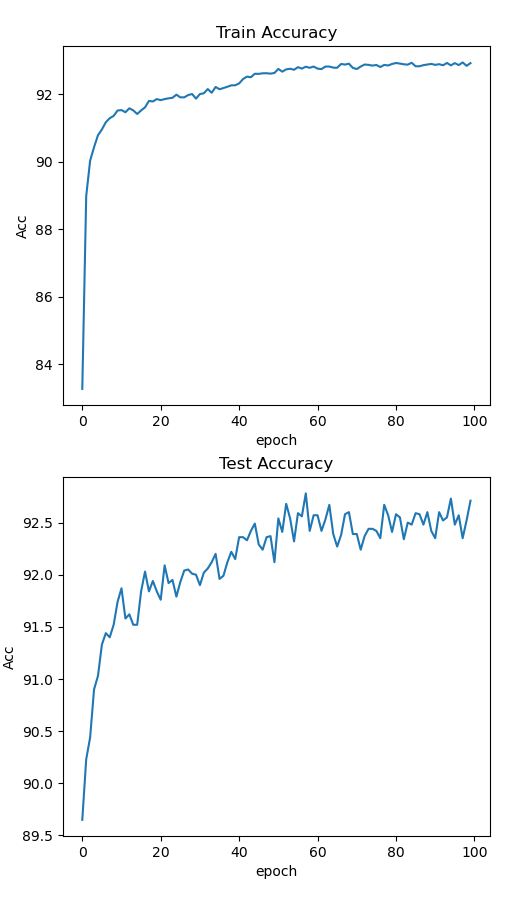

.. SPAIC documentation master file, created by
   sphinx-quickstart on Fri Nov 12 13:37:53 2021.
   You can adapt this file completely to your liking, but it should at least
   contain the root `toctree` directive.

.. _index_en:

Welcome to SPAIC's documentation!
#################################################

`SPAIC <https://github.com/ZhejianglabNCRC/SPAIC>`_ (spike based artificial intelligence computing) \
is a brain-inspired computing framework for combining neuroscience with machine learning.

* :ref:`中文首页(Chinese homepage) <index_cn>`

I. How to install
=======================
Install the latest version from source code:

From GitHub:

.. code-block:: python

   git clone https://github.com/ZhejianglabNCRC/SPAIC.git
   cd SPAIC
   python setup.py install

II. How to build a spiking neural network
==============================================
In order to facilitate users to understand how to use **SPAIC** to carry out their own \
research work, we will use **STCA** learning algorithm [#f1]_ to train the network to \
recognize **MNIST** data set as an example to build a SNN training network.

1. Construct a network class
---------------------------------
``Network`` is the most important part of **SPAIC**, like the framework of the whole neural \
network, so we need to build a network class first, and then fill this network with other \
elements, such as neurons and connections. Inherit :code:`spaic.Network` To recreate \
and instantiate a network class:

.. code-block:: python

   class SampleNet(spaic.Network):
      def __init__(self):
         super(SampleNet, self).__init__()
            ......

   Net = SampleNet()

2. Add Network Components
------------------------------
When building the framework of :code:`Network`, we need to add neurons and connect these \
components in it, so that the :code:`Network` will not be an empty framework. The components \
that can be added include the input and output parts: :code:`Node`; the neurongroup :code:`NeuronGroups`; \
the synapse connection :code:`connection`; the monitor :code:`monitor` ;\
the learning algorithm: :code:`learner`. Also, we can add some \
special components when building some large and complex networks, :code:`Assembly` and :code:`Projection` , \
which used to let the complex structures more clearly.

2.1 Create Node and NeuronGroups
^^^^^^^^^^^^^^^^^^^^^^^^^^^^^^^^^^^^^^
For a network that uses **STCA** algorithm and recognize **MNIST** dataset, the node we need \
is a :code:`Node.Encoder` layer as input to encode the input data, a :code:`clif NeuronGroup` \
layer for training and a :code:`Node.Decoder` layer as output \
to decode the output data. So, what we need to do is add:

.. code-block:: python

   self.input = spaic.Encoder(num=784, coding_method='poisson')
   self.layer1 = spaic.NeuronGroup(num=10, model='clif')
   self.output = spaic.Decoder(num=10, dec_target=self.layer1)

.. note::

   To be mentioned, the number of the neuron in :code:`output` need to be same as the target layer of :code:`dec_target` .

2.2 Construct connections
^^^^^^^^^^^^^^^^^^^^^^^^^^^^

In this example, since the network structure is fairly simple, all required \
is a simple ``full connection`` that connecting the input layer to the training layer.

.. code-block:: python

   self.connection1 = spaic.Connection(self.input, self.layer1, link_type='full')

2.3 Add learning algorithm and optimization algorithm
^^^^^^^^^^^^^^^^^^^^^^^^^^^^^^^^^^^^^^^^^^^^^^^^^^^^^^^^
In this example, we use **STCA** algorithm [#f1]_, it is a **BPTT** algorithm that use surrogate \
gradient strategy. And we choose :code:`Adam` as our optimizer and set

.. code-block:: python

   self.learner = spaic.Learner(trainable=self, algorithm='STCA')
   self.learner.set_optimizer('Adam', 0.001)

2.4 Add monitor
^^^^^^^^^^^^^^^^^^^^^^^^^^^^^^^^^
In this example, although it is not necessary to add a monitor, we can monitor the \
voltage and spike output of :code:`layer1` for teaching purposes, i.e.

.. code-block:: python

   self.mon_V = spaic.StateMonitor(self.layer1, 'V')
   self.spk_O = spaic.SpikeMonitor(self.layer1, 'O')

2.5 Add backend
^^^^^^^^^^^^^^^^^^^^^^^^^^^^^^^^^^^^^
``Backend`` is an extremely important part of **SPAIC**, responsible for the actual simulation \
of the backend network.  :code:`backend.dt`  is used to set the time step for network \
simulation, which needs to be set in advance before establishing the network. \
The selection of different backends and devices also needs to be set up before building \
the network. In this example, we use **PyTorch** as the backend simulator and build the network \
with **cuda**.  Use :code:`0.1ms` as the time step

.. code-block:: python

      # Method 1:
      if torch.cuda.is_available():
          device = 'cuda'
      else:
          device = 'cpu'
      backend = spaic.Torch_Backend(device)
      backend.dt = 0.1
      self.set_backend(backend)

      # Method 2:
      self.set_backend('PyTorch', 'cuda')
      self.set_backend_dt(0.1)

2.6 Overall network structure
^^^^^^^^^^^^^^^^^^^^^^^^^^^^^^^^^^^^^^^

.. code-block:: python

   import spaic
   import torch

   class TestNet(spaic.Network):
       def __init__(self):
           super(TestNet, self).__init__()

           # Encoding
           self.input = spaic.Encoder(num=784, coding_method='poisson')

           # NeuronGroup
           self.layer1 = spaic.NeuronGroup(num=10, model='clif')

           # Decoding
           self.output = spaic.Decoder(num=10, dec_target=self.layer1, coding_method='spike_counts')

           # Connection
           self.connection1 = spaic.Connection(pre=self.input, post=self.layer1, link_type='full')

           # Monitor
           self.mon_V = spaic.StateMonitor(self.layer1, 'V')
           self.spk_O = spaic.SpikeMonitor(self.layer1, 'O')

           # Learner
           self.learner = spaic.Learner(trainable=self, algorithm='STCA')
           self.learner.set_optimizer('Adam', 0.001)

           if torch.cuda.is_available():
               device = 'cuda'
           else:
               device = 'cpu'
           backend = spaic.Torch_Backend(device)
           backend.dt = 0.1

           self.set_backend(backend)

   # Network instantiation
   Net = TestNet()

3. Start training
------------------

3.1 Load the dataset
^^^^^^^^^^^^^^^^^^^^^^^^

.. code-block:: python

   from tqdm import tqdm
   import torch.nn.functional as F
   from spaic.IO.Dataset import MNIST as dataset
   # Create the training data set
   root = './spaic/Datasets/MNIST'
   train_set = dataset(root, is_train=True)
   test_set = dataset(root, is_train=False)

   # Set the run time and batch size
   run_time = 50
   bat_size = 100

   # Create the DataLoader iterator
   train_loader = spaic.Dataloader(train_set, batch_size=bat_size, shuffle=True, drop_last=False)
   test_loader = spaic.Dataloader(test_set, batch_size=bat_size, shuffle=False)

3.2 Run the network
^^^^^^^^^^^^^^^^^^^^^^^^^^^^^^

.. code-block:: python

   eval_losses = []
   eval_acces = []
   losses = []
   acces = []
   num_correct = 0
   num_sample = 0
   for epoch in range(100):

       # Train
       print("Start training")
       train_loss = 0
       train_acc = 0
       pbar = tqdm(total=len(train_loader))
       for i, item in enumerate(train_loader):
           # forward propagation
           data, label = item
           Net.input(data)
           Net.output(label)
           Net.run(run_time)
           output = Net.output.predict
           output = (output - torch.mean(output).detach()) / (torch.std(output).detach() + 0.1)
           label = torch.tensor(label, device=device)
           batch_loss = F.cross_entropy(output, label)

           # Back propagation
           Net.learner.optim_zero_grad()
           batch_loss.backward(retain_graph=False)
           Net.learner.optim_step()

           # Record the error
           train_loss += batch_loss.item()
           predict_labels = torch.argmax(output, 1)
           num_correct = (predict_labels == label).sum().item()  # Record the number of correct tags
           acc = num_correct / data.shape[0]
           train_acc += acc

           pbar.set_description_str("[loss:%f]Batch progress: " % batch_loss.item())
           pbar.update()
       pbar.close()
       losses.append(train_loss / len(train_loader))
       acces.append(train_acc / len(train_loader))
       print('epoch:{},Train Loss:{:.4f},Train Acc:{:.4f}'.format(epoch, train_loss / len(train_loader), train_acc / len(train_loader)))

       # Test
       eval_loss = 0
       eval_acc = 0
       print("Start testing")
       pbarTest = tqdm(total=len(test_loader))
       with torch.no_grad():
           for i, item in enumerate(test_loader):
               data, label = item
               Net.input(data)
               Net.run(run_time)
               output = Net.output.predict
               output = (output - torch.mean(output).detach()) / (torch.std(output).detach() + 0.1)
               label = torch.tensor(label, device=device)
               batch_loss = F.cross_entropy(output, label)
               eval_loss += batch_loss.item()

               _, pred = output.max(1)
               num_correct = (pred == label).sum().item()
               acc = num_correct / data.shape[0]
               eval_acc += acc
               pbarTest.set_description_str("[loss:%f]Batch progress: " % batch_loss.item())
               pbarTest.update()
           eval_losses.append(eval_loss / len(test_loader))
           eval_acces.append(eval_acc / len(test_loader))
       pbarTest.close()
       print('epoch:{},Test Loss:{:.4f},Test Acc:{:.4f}'.format(epoch,eval_loss / len(test_loader), eval_acc / len(test_loader)))

4. Training results
-----------------------
After training and testing 100 epochs, we get the following accuracy curve through matplotlib

.. code-block:: python

   from matplotlib import pyplot as plt
   plt.subplot(2, 1, 1)
   plt.plot(acces)
   plt.title('Train Accuracy')
   plt.ylabel('Acc')
   plt.xlabel('epoch')

   plt.subplot(2, 1, 2)
   plt.plot(test_accuracy)
   plt.title('Test Accuracy')
   plt.ylabel('Acc')
   plt.xlabel('epoch')

   plt.show()

5. Save model
-------------------
After the training is completed, we can store the weight information through the built-in function :code:`Network.save_state` , \
or use :code:`spaic.Network_saver.network_save` to store the overall network structure and weight.

Method 1: (only store weights)

.. code-block:: python

   save_file = Net.save_state("TestNetwork")

Method 2: (store network structure and weights at the same time)

.. code-block:: python

   save_file = network_save(Net, "TestNetwork", trans_format='json')

.. note::

   In method 2, the format of the network structure storage can be :code:`json` or :code:`yaml` , both of which can be read directly without transmitted.
   The weights of the first and second methods are stored in the tensor format of **Pytorch** recently.

Additional: Other ways of constructing networks
==========================
1. the form using 'with'
--------------------------------
.. code-block:: python

   # Initializes an object of the base network class
   Net = spaic.Network()

   # The network structure is established by defining network units in with
   with Net:
       # Create an input node and select the input encoding form
       input1 = spaic.Encoder(784, encoding='poisson')

       # Establish the neuron cluster, select the neuron type, and set the neuron
       # parameters such as discharge threshold and membrane voltage time constant
       layer1 = spaic.NeuronGroup(10, model='clif')

       # Establish connections between nerve clusters
       connection1 = spaic.Connection(input1, layer1, link_type='full')

       # Set up the output node and select the output decoding form
       output = spaic.Decoder(num=10, dec_target=self.layer1,
                                          coding_method='spike_counts')

       # establish state detector, it can monitor the state of neurons, input and
       # output nodes, connections and other units
       monitor1 = spaic.StateMonitor(layer1, 'V')

       # Add the learning algorithm and select the network structure to be trained,
       # (self stands for the whole ExampleNet structures)
       learner = spaic.Learner(trainable=self, algorithm='STCA')

       # Add optimization algorithm
       learner.set_optimizer('Adam', 0.001)

2. Import and modify the base model to construct a network model
-------------------------------------------------------------------------
.. code-block:: python

   from spaic.Library import ExampleNet
   Net = ExampleNet()
   # Neuron parameter
   neuron_param = {
       'tau_m': 8.0,
       'V_th': 1.5,
   }
   # Creating new neuron clusters
   layer3 = spaic.NeuronGroup(100, model='lif', param=neuron_param)
   layer4 = spaic.NeuronGroup(100, model='lif', param=neuron_param)

   # Add new set members to a neural set
   Net.add_assembly('layer3', layer3)
   # Delete an existing set member from the neural set
   Net.del_assembly(Net.layer3)
   # Copy an existing Assembly structure and add the new assembly to the neural set
   Net.copy_assembly('net_layer', ExampleNet())
   # Replace an existing neural set within the set with a new neural set
   Net.replace_assembly(Net.layer1, layer3)
   # Combine this neural with another neural set to obtain a new neural set
   Net2 = ExampleNet()
   Net.merge_assembly(Net2)
   # Connect two nerve clusters within a nerve set
   con = spaic.Connection(Net.layer2, Net.net_layer, link_type='full')
   Net.add_connection('con3', con)
   # Take out some members of this nerve set and the connections between them
   # to form a new nerve set, and the original nerve set remains unchanged
   Net3 = Net.select_assembly([Net.layer2, net_layer])

User manual:
=================

.. toctree::
   :maxdepth: 1
   :caption: Tutorials

   basic_structure_en/0_index
   input_output_en
   backend_en
   save_model_en
   custom_en/0_index
   monitor_en

Contact us:
==============================================
Chaofei Hong: hongchf@zhejianglab.com

Mengwen Yuan: yuanmw@zhejianglab.com

Mengxiao Zhang: mxzhang@zhejianglab.com

.. _index_cn:

欢迎来到SPAIC的文档网站!
#################################################

`SPAIC <https://github.com/ZhejianglabNCRC/SPAIC>`_ (spike based artificial intelligence computing) \
是一个用于结合神经科学与机器学习的类脑计算框架。

* :ref:`Homepage in English <index_en>`

I. 如何安装
============
通过源代码安装最新版本：

通过GitHub：

.. code-block:: python

   git clone https://github.com/ZhejianglabNCRC/SPAIC.git
   cd SPAIC
   python setup.py install

II. 如何从零开始构建一个脉冲神经网络
====================================
为了便于用户了解该如何使用 **SPAIC** 开展自己的研究工作，我们将以使用 **STCA** 学习算法 [#f1]_ 训练识别 **MNIST**数据集\
的网络作为例子，搭建一个SNN训练网络。

1. 建立一个网络
---------------------
网络是 **SPAIC** 中最为重要的组成部分，如同整个神经网络的框架部分，所以我们需要首先先建立一个\
网络，再在这个网络中填充其他的元素，例如神经元和连接。继承 :code:`spaic.Network` 来重新建立一个\
网络类并实例化：

.. code-block:: python

   class SampleNet(spaic.Network):
      def __init__(self):
         super(SampleNet, self).__init__()
            ......

   Net = SampleNet()

2. 添加网络组件
----------------------
在搭建 :code:`Network` 这个框架时，我们需要在其内部添加神经元和连接这些组件，从而使得这个网络并不是\
单纯的一张白纸，能够添加的组件包括了输入输出部分的 :code:`Node` 、神经元组的 :code:`NeuronGroups`、\
突触连接 :code:`connections` 、监视器 :code:`monitors` 、学习算法 :code:`learners`。或者，\
我们在构建大型复杂网络时可以添加一些特殊的部件, :code:`Assembly` 以及 :code:`Projection`，用于将复杂的结构\
更加清晰地分层构建。

2.1 创建并添加节点层与神经元组
^^^^^^^^^^^^^^^^^^^^^^^^^^^^^^^^^^^^^^
对于一个使用 **STCA** 训练识别 **MNIST** 数据集的网络而言，我们需要的节点分别是一个input层用于编码并输\
入数据，一个 :code:`clif` 神经元层用于训练以及一个输出层用于解码脉冲输出。所以我们所添加的就是：

.. code-block:: python

   self.input = spaic.Encoder(num=784, coding_method='poisson')
   self.layer1 = spaic.NeuronGroup(num=10, model='clif')
   self.output = spaic.Decoder(num=10, dec_target=self.layer1)

.. note::

   这里较为需要注意的是，:code:`output` 层的数量需要与其 :code:`dec_target` 目标层的神经元数量一致。

2.2 建立连接
^^^^^^^^^^^^^^^^^^^^^^^^^^^^
在本示例中，因为网络结构相当简单，所以需要的连接只是一个简单的全连接将输入层与训练层连接到一起。

.. code-block:: python

   self.connection1 = spaic.Connection(self.input, self.layer1, link_type='full')
   # self.connection1 = spaic.Connection(pre=self.input, post=self.layer1, link_type='full')

2.3 添加学习算法与优化算法
^^^^^^^^^^^^^^^^^^^^^^^^^^^^^^
在本示例中，我们采用了 **STCA** 学习算法， **STCA** 学习算法 [#f1]_ 是一种采用了替代梯度策略的BPTT类算法。\
优化器则选择 :code:`Adam` 算法并设置学习率为0.001。

.. code-block:: python

   self.learner = spaic.Learner(trainable=self, algorithm='STCA')
   self.learner.set_optimizer('Adam', 0.001)

2.4 添加监视器
^^^^^^^^^^^^^^^^^^^^^^^^^^^^^^^^^
在本示例中，虽然没有添加监视器的必要，但是作为教学，我们可以对 :code:`layer1` 的电压与脉冲输出进行监控，即：

.. code-block:: python

   self.mon_V = spaic.StateMonitor(self.layer1, 'V')
   self.spk_O = spaic.SpikeMonitor(self.layer1, 'O')
   # self.mon_V = spaic.StateMonitor(target=self.layer1, var_name='V')

2.5 添加backend
^^^^^^^^^^^^^^^^^^^^^^^^^^^^^^^^^^^^^
``Backend`` 是 **SPAIC** 中极为重要的一个部分，负责后端网络的实际模拟。 :code:`backend.dt` 用于\
设置网络模拟的时间步长，需要在建立网络前提前进行设定。不同后端以及设备的选择也需要在搭建网络前设置\
完成。在本示例，我们采用 **PyTorch** 作为后端，将网络构建于 **cuda** 上，以 :code:`0.1ms` 作为时间步长：

.. code-block:: python

   # 方式一：
      if torch.cuda.is_available():
          device = 'cuda'
      else:
          device = 'cpu'
      backend = spaic.Torch_Backend(device)
      backend.dt = 0.1
      self.set_backend(backend)

   # 方式二：
      self.set_backend('PyTorch', 'cuda')
      self.set_backend_dt(0.1)
      # self.set_backend(backend='PyTorch', device='cuda')
      # self.set_backend_dt(dt=0.1)

2.6 整体网络结构
^^^^^^^^^^^^^^^^^^^^^^^^^^^^^^^^^^^^^^^

.. code-block:: python

   import spaic
   import torch

   class TestNet(spaic.Network):
       def __init__(self):
           super(TestNet, self).__init__()

           # Encoding
           self.input = spaic.Encoder(num=784, coding_method='poisson')

           # NeuronGroup
           self.layer1 = spaic.NeuronGroup(num=10, model='clif')

           # Decoding
           self.output = spaic.Decoder(num=10, dec_target=self.layer1, coding_method='spike_counts')

           # Connection
           self.connection1 = spaic.Connection(pre=self.input, post=self.layer1, link_type='full')

           # Monitor
           self.mon_V = spaic.StateMonitor(self.layer1, 'V')
           self.spk_O = spaic.SpikeMonitor(self.layer1, 'O')

           # Learner
           self.learner = spaic.Learner(trainable=self, algorithm='STCA')
           self.learner.set_optimizer('Adam', 0.001)

           if torch.cuda.is_available():
               device = 'cuda'
           else:
               device = 'cpu'
           backend = spaic.Torch_Backend(device)
           backend.dt = 0.1

           self.set_backend(backend)

   # 网络实例化
   Net = TestNet()

3. 开始训练
------------------

3.1 加载数据集
^^^^^^^^^^^^^^^^^^^^^^^^

.. code-block:: python

   from tqdm import tqdm
   import torch.nn.functional as F
   from spaic.IO.Dataset import MNIST as dataset
   # 创建训练数据集
   root = './spaic/Datasets/MNIST'
   train_set = dataset(root, is_train=True)
   test_set = dataset(root, is_train=False)

   # 设置运行时间与批处理规模
   run_time = 50
   bat_size = 100

   # 创建DataLoader迭代器
   train_loader = spaic.Dataloader(train_set, batch_size=bat_size, shuffle=True, drop_last=False)
   test_loader = spaic.Dataloader(test_set, batch_size=bat_size, shuffle=False)

3.2 运行网络
^^^^^^^^^^^^^^^^^^^^^^^^^^^^^^

.. code-block:: python

   eval_losses = []
   eval_acces = []
   losses = []
   acces = []
   num_correct = 0
   num_sample = 0
   for epoch in range(100):

       # 训练阶段
       print("Start training")
       train_loss = 0
       train_acc = 0
       pbar = tqdm(total=len(train_loader))
       for i, item in enumerate(train_loader):
           # 前向传播
           data, label = item
           Net.input(data)
           Net.output(label)
           Net.run(run_time)
           output = Net.output.predict
           output = (output - torch.mean(output).detach()) / (torch.std(output).detach() + 0.1)
           label = torch.tensor(label, device=device)
           batch_loss = F.cross_entropy(output, label)

           # 反向传播
           Net.learner.optim_zero_grad()
           batch_loss.backward(retain_graph=False)
           Net.learner.optim_step()

           # 记录误差
           train_loss += batch_loss.item()
           predict_labels = torch.argmax(output, 1)
           num_correct = (predict_labels == label).sum().item()  # 记录标签正确的个数
           acc = num_correct / data.shape[0]
           train_acc += acc

           pbar.set_description_str("[loss:%f]Batch progress: " % batch_loss.item())
           pbar.update()
       pbar.close()
       losses.append(train_loss / len(train_loader))
       acces.append(train_acc / len(train_loader))
       print('epoch:{},Train Loss:{:.4f},Train Acc:{:.4f}'.format(epoch, train_loss / len(train_loader), train_acc / len(train_loader)))

       # 测试阶段
       eval_loss = 0
       eval_acc = 0
       print("Start testing")
       pbarTest = tqdm(total=len(test_loader))
       with torch.no_grad():
           for i, item in enumerate(test_loader):
               data, label = item
               Net.input(data)
               Net.run(run_time)
               output = Net.output.predict
               output = (output - torch.mean(output).detach()) / (torch.std(output).detach() + 0.1)
               label = torch.tensor(label, device=device)
               batch_loss = F.cross_entropy(output, label)
               eval_loss += batch_loss.item()

               _, pred = output.max(1)
               num_correct = (pred == label).sum().item()
               acc = num_correct / data.shape[0]
               eval_acc += acc
               pbarTest.set_description_str("[loss:%f]Batch progress: " % batch_loss.item())
               pbarTest.update()
           eval_losses.append(eval_loss / len(test_loader))
           eval_acces.append(eval_acc / len(test_loader))
       pbarTest.close()
       print('epoch:{},Test Loss:{:.4f},Test Acc:{:.4f}'.format(epoch,eval_loss / len(test_loader), eval_acc / len(test_loader)))

4. 训练结果
--------------
在训练并测试共100个epoch后，通过 **matplotlib** 我们得到如下的准确率曲线：

.. code-block:: python

   from matplotlib import pyplot as plt
   plt.subplot(2, 1, 1)
   plt.plot(acces)
   plt.title('Train Accuracy')
   plt.ylabel('Acc')
   plt.xlabel('epoch')

   plt.subplot(2, 1, 2)
   plt.plot(test_accuracy)
   plt.title('Test Accuracy')
   plt.ylabel('Acc')
   plt.xlabel('epoch')

   plt.show()

5. 保存网络
-------------------
在训练完成之后，我们可以通过 :code:`Network` 内置的 :code:`save_state` 函数将权重信息存储下来，也可以通过 :code:`spaic.Network_saver.network_save` 函数\
将整体网络的结构以及权重一同存储下来。

方式一：（只存储权重）

.. code-block:: python

   save_file = Net.save_state(filename="TestNetwork")

方式二：（同时存储网络结构以及权重）

.. code-block:: python

   save_file = network_save(Net, "TestNetwork", trans_format='json')
   # save_file = network_save(Net=Net, filename="TestNetwork", trans_format='json')

.. note::

   在方式二中，网络结构存储的格式可以为 :code:`json` 亦或是 :code:`yaml` 格式，这两种格式都是可以直接阅读不需要转译的。\
   而方式一与方式二这两种方式的权重都以 **Pytorch** 的Tensor格式存储。

附：网络的其他构建方式
==========================
1. with形式
-----------------------
.. code-block:: python

   # 初始化基本网络类的对象
   Net = spaic.Network()

   # 通过把网络单元在with内定义，建立网络结构
   with Net:
       # 建立输入节点并选择输入编码形式
       input1 = spaic.Encoder(784, encoding='poisson')

       # 建立神经元集群，选择神经元类型，并可以设置 放电阈值、膜电压时间常数等神经元参数值
       layer1 = spaic.NeuronGroup(10, model='clif')

       # 建立神经集群间的连接
       connection1 = spaic.Connection(input1, layer1, link_type='full')

       # 建立输出节点，并选择输出解码形式
       output = spaic.Decoder(num=10, dec_target=self.layer1, coding_method='spike_counts')

       # 建立状态检测器，可以Monitor神经元、输入输出节点、连接等多种单元的状态量
       monitor1 = spaic.StateMonitor(layer1, 'V')

       # 加入学习算法，并选择需要训练的网络结构，（self代表全体ExampleNet结构）
       learner = spaic.Learner(trainable=self, algorithm='STCA')

       # 加入优化算法
       learner.set_optimizer('Adam', 0.001)

2. 通过引入模型库模型并进行修改的方式构建网络
----------------------------------------------
.. code-block:: python

   from spaic.Library import ExampleNet
   Net = ExampleNet()
   # 神经元参数
   neuron_param = {
       'tau_m': 8.0,
       'V_th': 1.5,
   }
   # 新建神经元集群
   layer3 = spaic.NeuronGroup(100, model='lif', param=neuron_param)
   layer4 = spaic.NeuronGroup(100, model='lif', param=neuron_param)

   # 向神经集合中加入新的集合成员
   Net.add_assembly('layer3', layer3)
   # 删除神经集合中已经存在集合成员
   Net.del_assembly(Net.layer3)
   # 复制一个已有的assembly结构，并将新建的assembly加入到此神经集合
   Net.copy_assembly('net_layer', ExampleNet())
   # 将集合内部已有的一个神经集合替换为一个新的神经集合
   Net.replace_assembly(Net.layer1, layer3)
   # 将此神经集合与另一个神经集合进行合并，得到一个新的神经集合
   Net2 = ExampleNet()
   Net.merge_assembly(Net2)
   #连接神经集合内部两个神经集群
   con = spaic.Connection(Net.layer2, Net.net_layer, link_type='full')
   Net.add_connection('con3', con)
   #将此神经集合中的部分集合成员以及它们间的连接取出来组成一个新的神经集合，原神经集合保持不变
   Net3 = Net.select_assembly([Net.layer2, net_layer])

用户手册:
=================

.. toctree::
   :maxdepth: 1
   :caption: 教程

   basic_structure/0_index
   input_output
   backend
   save_model
   custom/0_index
   monitor

联系我们：
==============================================
洪朝飞：hongchf@zhejianglab.com

袁孟雯：yuanmw@zhejianglab.com

张梦骁：mxzhang@zhejianglab.com

文档索引
====================

* :ref:`genindex`
* :ref:`modindex`

.. [#f1]  Pengjie Gu et al. “STCA: Spatio-Temporal Credit Assignment with Delayed Feedback in Deep SpikingNeural Networks.” In:Proceedings of the Twenty-Eighth International Joint Conference on Artificial Intelligence, IJCAI-19. International Joint Conferences on Artificial Intelligence Organization, July 2019,pp. 1366–1372. `doi:10.24963/ijcai.2019/189. <https://doi.org/10.24963/ijcai.2019/189>`_

